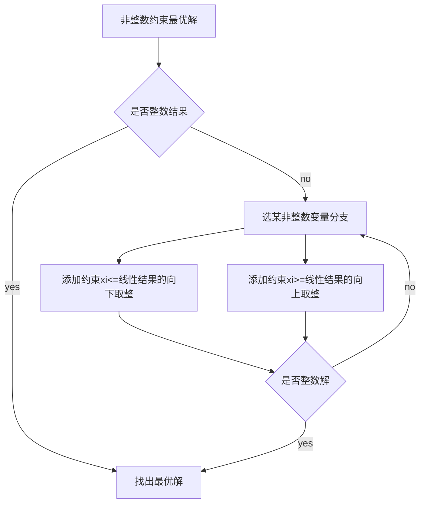
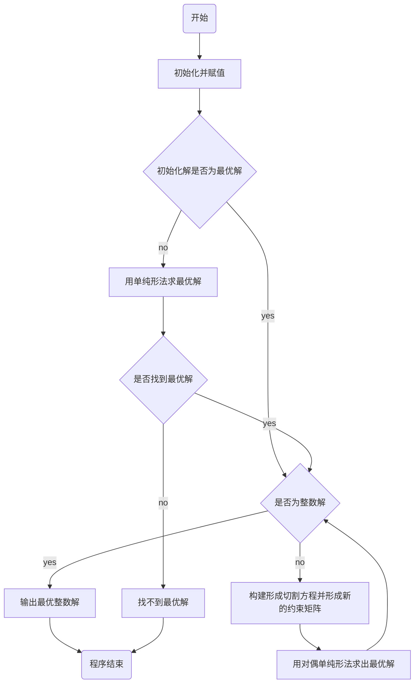

# 建模模型概念

## 线性规划

目标函数及约束条件均为线性函数，故被称为线性规划问题。线性规划问题是在一组线性约束条件的限制下,求一线性目标函数最大或最小的问题。

案例：某机床厂生产甲、乙两种机床，每台销售后的利润分别为4千元与3千元。生产甲机床需用A、B机器加工，加工时间分别为每台2小时和1小时;生产乙机床需用A、B、C三种机器加工,加工时间为每台各一小时。若每天可用于加工的机器时数分别为A机器10小时、B机器8小时和C机器7小时，求该厂应生产甲、乙机床各几台，才能使总利润最大。

标准形式:
$$
minc^Tx\\
x\\
x.t. \left\{
\begin{aligned}
Ax\leq b\\
Aeq\cdot x=beq\\
lb\leq x \leq ub
\end{aligned}
\right.
$$

## 整数规划

数学规划中的变量（部分或全部）限制为整数时，成为整数规划。若在线性规划模型中，变量限制为整数， 则称为整数线性规划。目前所流行的求解整数规划的方 法，往往只适用于整数线性规划。目前还没有一种方法 能有效地求解一切整数规划。
$$
\left\{
\begin{aligned}
纯（完全）整数规划\\
混合整数规划
\end{aligned}
\right.
$$
特点：

原线性规划有最优解，当自变量限制为整数 后，其整数规划解出现下述情况

1. 原线性规划最优解全是整数，则整数规划最优 解与线性规划最优解一致

2. 整数规划无可行解
3. 有可行解（当然就存在最优解），但最优解值变差

整数规划最优解不能按照实数最优解（例如线性规划求解）简单取整而获得。

案例：

设用某型号的圆钢下零件，A2，……，Am的毛胚。在一根圆钢上下料的方式有B1，B2，……，Bn种。每种下料方式可以得到各种零件的毛胚数以及每种零件的需要量，如表所示。问怎样安排下料方式，使得即满足需要，所用的原材料又最少。

|           零件个数            |             B1……Bn  (方式)             |      零件毛胚数       |
| :---------------------------: | :------------------------------------: | :-------------------: |
| （零件） A1 …… Am |  a11……a1n …… am1……amn  |  b1 …… bm |

一般形式：
$$
max(min)z=\sum_{j=1}^nc~j~x~j~\\
s.t\left\{
\begin{aligned}
\sum_{j=1}^na~ij~x~j~\leq(=,\geq)b~i~(i=1,2,…n)\\
x~j~\geq0,x~j~为整数(j=1,2,…n)\\
\end{aligned}
\right.
$$

1. 纯整数规划：所有决策变量要求取非负整数（这时引进的松弛变量和剩余变量可以不要求取整数）。

   松弛变量：x1+x2<=10,x1+x2+x3=10,x3>=0,x3为松弛变量

   剩余变量：x1+x2>=10,x1+x2-x3=10,x3<=0,-x3为剩余变量

2. 全整数规划：除了所有决策变量要求取非负整数外，系数aij和常数bi也要求取整数（这时引进的松弛变量和剩余变量也必须是整数）。
3. 混合整数规划：只有一部分的决策变量要求取非负整数，另一部分可以取非负实数。
4. 0-1整数规划：所有决策变量只能取0或1两个整数。(工作安排问题)

整数规划可行解是线性规划可行域中的整数格点

线性规划无可行解，则整数规划无可行解

ILP最优解小于或等于线性规划的最优值

线性规划最优解满足整数要求，则该最优解为整数规划的最优解

### 分支定界算法

### 割平面算法

即对（P0）增加一个线性约束，将（P0）的可行区域割掉一块，使得非整数解恰好在割掉的一块中，但是又没有割掉原问题（P）的可行解，得到问题（P1），重复上述的过程。

###  匈牙利算法

0-1规划问题

典型：指派问题

所谓的指派问题就比如：甲乙丙三个人去做ABC三件事情。每个人做每件事情所花的时间可能不一样。每个人只能安排一件事情，问怎样安排才能使三个人所工作的时间之和最小？
扩展成 n 个人 n 件事也可以，但要求是：事情数和人数一样多，并且每人只能做一件事。

数学模型：
$$
x~ij~=\left\{
\begin{aligned}
1第i个人做第j项工作\\
0第i个人不做j项工作\\
\end{aligned}
\right.
(i,j=1,…,n)\\
X=(x~ij~)~n\times n~\\
minz=\sum_{i=1}^n\sum_{j=1}^nc~ij~x~ij~\\
s.t.\left\{
\begin{aligned}
\sum_{j=1}^nx~ij~=1(i=1,…,n)\\
\sum_{i=1}^nx~ij~=1(j=1,…,n)\\
x~ij~=0或1(i,j=1,…,n)
\end{aligned}
\right.
$$
指派问题可行解中，每列每行有且仅有一个1

非标准形式的指派问题：

1. 最大指派问题

$$
C=(c~ij~)~n\times n~中最大元素为m，令B=(b~ij~)~n\times n~=(m-c~ij~)~n\times n~
$$

2. 人数和工作数不等

   人少工作多：添加虚拟的“人”，代价都为0

   人多工作少：添加虚拟的工作，代价都为0

3. 一个人可做多件工作

   该人可化为几个相同的“人”

4. 某工作一定不能由某人做

   该人做该工作的相应代价取足够大M

