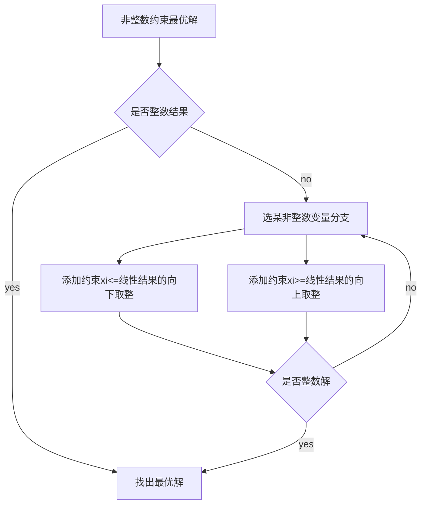
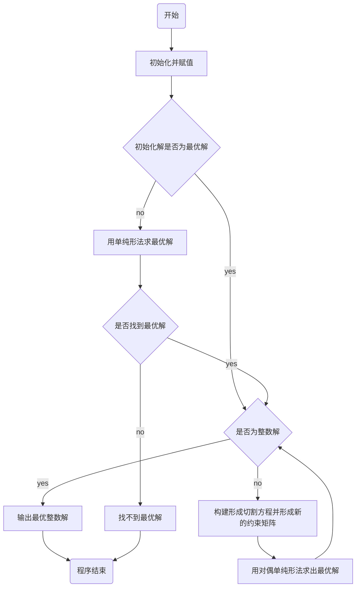

# 建模模型概念

## 线性规划

目标函数及约束条件均为线性函数，故被称为线性规划问题。线性规划问题是在一组线性约束条件的限制下,求一线性目标函数最大或最小的问题。

案例：某机床厂生产甲、乙两种机床，每台销售后的利润分别为4千元与3千元。生产甲机床需用A、B机器加工，加工时间分别为每台2小时和1小时;生产乙机床需用A、B、C三种机器加工,加工时间为每台各一小时。若每天可用于加工的机器时数分别为A机器10小时、B机器8小时和C机器7小时，求该厂应生产甲、乙机床各几台，才能使总利润最大。

标准形式:
$$
minc^Tx\\
x\\
x.t. \left\{
\begin{aligned}
Ax\leq b\\
Aeq\cdot x=beq\\
lb\leq x \leq ub
\end{aligned}
\right.
$$

## 整数规划

数学规划中的变量（部分或全部）限制为整数时，成为整数规划。若在线性规划模型中，变量限制为整数， 则称为整数线性规划。目前所流行的求解整数规划的方 法，往往只适用于整数线性规划。目前还没有一种方法 能有效地求解一切整数规划。
$$
\left\{
\begin{aligned}
纯（完全）整数规划\\
混合整数规划
\end{aligned}
\right.
$$
特点：

原线性规划有最优解，当自变量限制为整数 后，其整数规划解出现下述情况

1. 原线性规划最优解全是整数，则整数规划最优 解与线性规划最优解一致

2. 整数规划无可行解
3. 有可行解（当然就存在最优解），但最优解值变差

整数规划最优解不能按照实数最优解（例如线性规划求解）简单取整而获得。

案例：

设用某型号的圆钢下零件，A2，……，Am的毛胚。在一根圆钢上下料的方式有B1，B2，……，Bn种。每种下料方式可以得到各种零件的毛胚数以及每种零件的需要量，如表所示。问怎样安排下料方式，使得即满足需要，所用的原材料又最少。

|           零件个数            |             B1……Bn  (方式)             |      零件毛胚数       |
| :---------------------------: | :------------------------------------: | :-------------------: |
| （零件） A1 …… Am |  a11……a1n …… am1……amn  |  b1 …… bm |

一般形式：
$$
max(min)z=\sum_{j=1}^nc~j~x~j~\\
s.t\left\{
\begin{aligned}
\sum_{j=1}^na~ij~x~j~\leq(=,\geq)b~i~(i=1,2,…n)\\
x~j~\geq0,x~j~为整数(j=1,2,…n)\\
\end{aligned}
\right.
$$

1. 纯整数规划：所有决策变量要求取非负整数（这时引进的松弛变量和剩余变量可以不要求取整数）。

   松弛变量：x1+x2<=10,x1+x2+x3=10,x3>=0,x3为松弛变量

   剩余变量：x1+x2>=10,x1+x2-x3=10,x3<=0,-x3为剩余变量

2. 全整数规划：除了所有决策变量要求取非负整数外，系数aij和常数bi也要求取整数（这时引进的松弛变量和剩余变量也必须是整数）。
3. 混合整数规划：只有一部分的决策变量要求取非负整数，另一部分可以取非负实数。
4. 0-1整数规划：所有决策变量只能取0或1两个整数。(工作安排问题)

整数规划可行解是线性规划可行域中的整数格点

线性规划无可行解，则整数规划无可行解

ILP最优解小于或等于线性规划的最优值

线性规划最优解满足整数要求，则该最优解为整数规划的最优解

### 分支定界算法

### 割平面算法

即对（P0）增加一个线性约束，将（P0）的可行区域割掉一块，使得非整数解恰好在割掉的一块中，但是又没有割掉原问题（P）的可行解，得到问题（P1），重复上述的过程。

###  匈牙利算法

0-1规划问题

典型：指派问题

所谓的指派问题就比如：甲乙丙三个人去做ABC三件事情。每个人做每件事情所花的时间可能不一样。每个人只能安排一件事情，问怎样安排才能使三个人所工作的时间之和最小？
扩展成 n 个人 n 件事也可以，但要求是：事情数和人数一样多，并且每人只能做一件事。

数学模型：
$$
x~ij~=\left\{
\begin{aligned}
1第i个人做第j项工作\\
0第i个人不做j项工作\\
\end{aligned}
\right.
(i,j=1,…,n)\\
X=(x~ij~)~n\times n~\\
minz=\sum_{i=1}^n\sum_{j=1}^nc~ij~x~ij~\\
s.t.\left\{
\begin{aligned}
\sum_{j=1}^nx~ij~=1(i=1,…,n)\\
\sum_{i=1}^nx~ij~=1(j=1,…,n)\\
x~ij~=0或1(i,j=1,…,n)
\end{aligned}
\right.
$$
指派问题可行解中，每列每行有且仅有一个1

非标准形式的指派问题：

1. 最大指派问题

$$
C=(c~ij~)~n\times n~中最大元素为m，令B=(b~ij~)~n\times n~=(m-c~ij~)~n\times n~
$$

2. 人数和工作数不等

   人少工作多：添加虚拟的“人”，代价都为0

   人多工作少：添加虚拟的工作，代价都为0

3. 一个人可做多件工作

   该人可化为几个相同的“人”

4. 某工作一定不能由某人做

   该人做该工作的相应代价取足够大M

## 非线性规划

如果目标函数或约束条件中包含非线性函数，就称这种规划问题为非线性规划问题。一般来说，解非线性规划要比解线性规划问题困难很多。而且，也不像线性规划有单纯形法这一通用方法，非线性规划目前还没有适于各种问题的一般算法，各个方法都有自己特定的适用范围。

案例：投资决策问题

某企业有n个项目可供选择投资，并且至少要对其中一个项目投资。已知该企业拥有投资总资金A元，投资于第i，i=1，2，……，n个项目需要花资金ai元，并预计可收益bi元，试选择最佳的投资方案。

数学模型

一般形式：
$$
minf(x)\\
s.t.\left\{
\begin{aligned}
h~j~(x)\leq0,j=1,2,...q\\
g~i~(x)=0,i=1,2,...p\\
\end{aligned}
\right.
$$
在一组等式或不等式的约束下，求一个函数的最大值（或最小值）问题，其中至少有一个非线性函数

特殊情况

二次规划：若某非线性规划的目标函数为自变量的二次函数，约束条件又全是线性的，就称这种规划为二次规划。

## 层次分析法

层次分析法是一种解决多目标的复杂问题的定性与定量相结合的决策分析方法。该方法将定量分析与定性结合起来，用决策者的经验判断各衡量目标能否实现的标准之间的相对重要程度，并合理地给出每个决策方案的每个标准的权数，利用权数求出各方案的优劣次序，比较有效第应用于那些难以用定量方法解决的课题。

糊的问题作出决策的简易方法，它特别适用于那些难于完全定量分析的问题。常用于**相互关联、相互制约的众多因素构成的复杂而往往缺少定量数据的系统**。

案例：

1. 买钢笔，一般要依据质量、颜色、实用性、价格等方面的因素来选择某一只钢笔。
2. 我们如果想要给一些问题的指标设定权重，而又减弱主观因素在里面。

根据问题的性质和要达到的总目标，将问题分解为不同的组成因素，并按照因素间相互关联影响以及隶属关系将因数按不同层次的聚集组合，形成一个多层次的分析结构模型，从而最终使文通归结为最低层（供决策的方案、措施等）相对于最高层（总目标）的相对重要权值的确定或相对优劣次序的排定。

步骤：

1. 建立层次结构模型

   - 将决策目标、考虑的因素（决策准则）和决策对象按它们之间的相互关系分为最高层、中间层和最底层，绘出层次结构图。

     **最高层**：决策的目的、要解决的问题。

     **最底层**：决策时的备选方案。

     **中间层**：考虑的因素、决策的准则。

   - 对于相邻的两层，最高层为目标层，低层为因素层。

2. 构造判断（成对比较）矩阵

   1. 不把所有因素放在一起比较，而是两两相互比较
   2. 对此时采用的相对尺度，以尽可能减少性质不同的诸因素相互比较的困难，以提高准确度。

   - 判断矩阵式表示本层所有因素针对上一层某一个因素的相对重要性的比较。
     - 心理学家认为成对比较的因素不宜超过9个，即每层不要超过9个因素。

3. 层次单排序及其一致性检验

   对于判断矩阵最大特征根的特征向量，经归一化（使向量中各元素之和等于1）后记为W。

   W的元素为同一层次因素对于上一层次因素某因素相对重要性的排序权值，这一过程称为层次单排序。

   能否确认层次单排序，需要进行一致性检验，所谓一致性检验是指对A确定不一致的允许范围。

   **定理**：n阶一致矩阵的唯一非零特征根为n

   **定理**：n阶正互反阵A的最大特征根$$ \lambda\geqn $$,当且仅当$$ \lambda=n $$时A为一致矩阵

4. 层次总排序及其一致性检验

   - 计算某一层次所有因素对于最高层（总目标）相对重要性的权值，称为层次总排序。
   - 这一过程是从最高层次到最低层次依次进行的。

## 灰色系统理论

应用范畴：

1. 灰色关联分析。
2. 灰色预测：人口预测；灾变预测…等等。
3. 灰色决策。
4. 灰色预测控制。

灰色系统理论是人们认识客观系统改造客观系统的一个新型的理论工具。

概念：

1. 灰色系统、白色系统和黑色系统

   - 白色系统是指一个系统的内部特征是完全已知的，即系统的信息是完全充分的。
   - 黑色系统是指一个系统的内部信息对外界来说是一无所知的，只能通过它与外界的联系来加以观测研究。
   - 灰色系统内的一部分信息是已知的，另外一部分信息是未知的，系统内各因素间有不确定的关系。

2. 灰色预测法

   - 灰色预测法是一种对含有不确定因素的系统进行预测的方法
   - 灰色预测是对既含有已知信息又含有不确定信息的系统进行预测，就是对在一定范围内变化的、与时间有关的灰色过程进行预测。

   灰色预测通过鉴别系统因素之间发展趋势的相异程度，即进行关联分析，并可对原始数据进行生成处理来寻找系统变动的规律，生成有较强规律性的数据序列，然后建立相应的微分方程模型，从而预测事物未来发展趋势的状况。

   灰色预测法用等时距观测到的反应预测对象特征的一系列数量值构造灰色预测模型，预测未来某一时刻的特征量，或达到某一特征量的时间。

3. 常见类型

   - 灰色时间序列预测

     即用观察到的反映预测对象特征的时间序列来构造灰色预测模型，预测未来某一时刻的特征量，或达到某一特征量的时间。

   - 畸变预测

     即通过灰色模型预测异常值出现的时刻，预测异常值什么时候出现在特定时区内。

   - 系统预测

     通过对系统行为特征指标建立一组相互关联的灰色预测模型，预测系统中众多变量间的相互协调关系的变化。

   - 拓扑预测

     将原始数据做曲线，在曲线上按定值寻找该定值变化发生的所有时点，并以该定值为框架构长成时点数列，然后建立模型预测该定值所发生的时点。

### 灰色关联度与优势分析

大千世界里的客观事物往往现象复杂，因素繁多。我们经常要对系统进行因素分析，这些因素中哪些对系统来讲是主要的，哪些是次要的，哪些需要发展，哪些需要抑制，哪些是潜在的，哪些是明显的。一般来讲，这些都是我们极为关心的问题。事实上，因素间关联性如何、关联程度如何量化等问题是系统分析的关键。

灰色关联度一定是分析向量与向量之间以及矩阵与矩阵之间的关联度。既然计算关联度，一定是计算某一个待比较的数列与参照物之间的相关程度。而回归分析方法需要大量数据、计算量大以及可能出现反常情况等。

### 灰色预测

灰色生成数列

灰色系统理论认为，尽管客观表象复杂，但总是有整体功能的，因此必然蕴含某种内在规律。关键在于如何选择适当的方式去挖掘和利用它。灰色系统是通过对原始数据的整理来寻求其变化规律的，这是一种就数据寻求数据的现实规律的途径，即为灰色序列的生成。一切灰色序列都能通过某种生成弱化其随机性，显现其规律性。数据生成的常用方式有累加生成、累减生成和加权累加生成。

1. 累加生成

   把数列各项数据依次累加的过程称为累加生成过程，由累加生成过程所得的数列称为累加生成数列。

2. 累减生成

   对于原始数据列依次做前后相邻的两个数据相减，与累加过程互为逆。

3. 加权邻值生成
   $$
   设原始数列为x^0=(x^0(1),x^0(2),...,x^0(n))\\
   对于常数\alpha\epsilon[0,1]\\
   令z^0(k)=\alpha x^0(k)+(1-\alpha)x^0(k-1),k=2,3,...,n\\
   得到数列z^0为数列x^0在权\alpha下的邻值生成数，权\alpha也称为生成系数\\
   特别的当生成系数\alpha=0.5时，称z^0为均值生成数，也称等权邻值生成数
   $$

## 插值拟合

### 插值问题

例题：在一天24小时内，从零点开始每间隔2小时测得的环境温度数据为

12，8，8，10，18，24，28

27，25，20，18，15，13

推测中午1点温度。

- 已知函数在某区间内若干点处的值，求函数在该区间内其它点处的值。

拉格朗日插值法的高次插值的Runge现象

- 在实际中不应使用七次以上插值。避免Runge现象的常用方法：将插值区间分成若干小区间，在小区间内用迪次插值，即分段低次插值，如样条函数插值。

一维插值优先选用样条函数插值

二维插值优先选用立方插值

### 拟合问题

例题：从1点到12点每隔一小时测量一次温度，测得的温度一次为

5，8，9，15，25，29

31，30，22，25，27，24

推测t=13.5时的温度

拟合问题和插值问题的区别：

1. 插值函数过已知点，而拟合函数不一定过已知点
2. 插值主要用于求函数值，而拟合的主要目的时求函数关系，从而进行预测等进一步的分析

## 模糊综合评价

- 模糊数学

  现实世界中许多现象和关系具有不确定性。这些不确定性的表现形式多种多样，如随机性、灰色性、模糊性和粗糙性等。

  模糊数学正是利用模糊集及其运算研究、处理模糊不确定现象和关系的数学分支学科。

  许多数学建模问题包括模糊现象和关系，这类问题往往可以用模糊数学方法处理。

- 模糊集

  现实中的许多现象及关系比较模糊。如高与矮，长与短，大与小，多与少，穷与富，好与差，年轻与年老等。

  此类现象不满足“非此即彼”的排中律，而具有“亦次亦彼”的模糊性。

  需要指出的是，模糊不确定不同于随机不确定。随机不确定是因果律破损造成的不确定，而模糊不确定是由于排中律破损造成的不确定。

  定义 设给定论域U，所谓U上的一个模糊集A是指对于任意x属于U，都能确定一个正数uA（x）属于[0

  ，1]用其表示x属于A1的程度。
  $$
  映射\\ x\epsilon U\rightarrow u~A~(x)\epsilon [0,1]
  $$
  称为A的隶属函数，函数值uA（x）称为x对A1的隶属度。

  每个元素都有隶属度的集合即为模糊集，确定模糊集的关键是构造隶属函数。

  **模糊集运算**：

  由于模糊集中没有元素和集合间的绝对隶属关系，所以模糊集的运算时通过隶属函数完成的。

  **隶属度函数的确定**：

  由于模糊集的概念可知，模糊数学的基本思想是隶属度，所以应用模糊数学方法建立数学模型的关键是建立符合实际的隶属关系。然而，如何确定一个模糊集的隶属函数至今还是尚未完全解决的问题。

  - 确定隶属度的常用方法是模糊分布法

    模糊分布法将隶属函数看成一种模糊分布，首先依据问题性质选取适当的模糊分布，然后再依据相关数据确定分布中的参数。

    1. 偏小型
       $$
       A(x)=
       s.t.\left\{
       \begin{aligned}
       1,x<a\\
       \frac{b-x}{b-a},a\leq x\leq b\\
       0,x>b\\
       \end{aligned}
       \right.
       $$
       
  2. 偏大型
       $$
       A(x)=
       s.t.\left\{
       \begin{aligned}
       0,x<a\\
       \frac{x-a}{b-a},a\leq x\leq b\\
       1,x>b\\
       \end{aligned}
       \right.
       $$
       
    3. 中间型
     $$
       A(x)=
       s.t.\left\{
       \begin{aligned}
       0,x<a\\
       \frac{x-a}{b-a},a\leq x< b\\
       1,b\leq x<c\\
       \frac{d-x}{d-c},c\leq x<d\\
       0,x\geq d\\
       \end{aligned}
       \right.
       $$
       
    
       中间型一般适用于描述处于中间状态的模糊现象。

- 模糊综合评价

  **基本思想：**

  以模糊数学为基础，应用模糊关系合成原理，将一些边界不清、不易定理的因素定量化，从多个因素对评价事物隶属等级状况进行综合评价。

  **具体步骤：**

  首先确定被评价对象的因素集和评价集，然后再分别确定各因素的权重及它们的隶属度向量，获得模糊评价矩阵，最后将模糊评价矩阵与因素的权向量进行模糊运算并归一化，从而得到模糊评价综合结果。

  案例：

  某服装厂欲采用模糊综合评价法来了解顾客对某种服装的欢迎程度。

  顾客是否喜欢某种服饰，通常与这种服装的花色、样式、价格、耐用度和舒适度等因素有关，故确定评价服装的因素集为U={花色，样式，价格，耐用度，舒适度}。

  综合评价的目的是弄清楚顾客对衣服各方面的欢迎程度。因此，评价集应为V={很欢迎，欢迎，一般，不欢迎}。

## 相关性分析

在统计学上，我们通常这样判断变量之间是否相关：如果一个变量的取值发生变化，另一个变量的取值也相应发生变化，则这两个变量有关。如果一个变量的变化不引起另一个变量的变化则二者无关。

**变量关系强度的含义：**指两个变量相关程度的高低。统计学中是以准实验的思想来分析相关变量的。通常从以下的角度分析：

1. 两变量是否相互独立。
2. 两变量是否有共变趋势。
3. 一变量的变化多大程度上能由另一变量的变化来解释。

**四种基本变量：**

1. 定类变量：根据定性的原则区分总体各个案类别的变量

   案例：性别、民族、婚姻情况

2. 定序变量：区别同一类别个案中等级次序的变量

   案例：文化程度、工厂规模、年龄大小

3. 定距变量：区别同一类别个案中等级次序及其距离的变量（没有零点的概念）

   案例：摄氏温度、比率、智力水平

4. 定比变量：也是区别同一类别个案等级次序及其距离的变量

   案例：收入、价格、市场占有率

### Pearson相关系数

使用于定距、定比类型的变量。是运用最广的一种相关程度统计量。检验用t统计量：其中统计量t服从自由度（n-2）的分布。

**使用条件：**

1. 两变量均应由测量得到的连续变量。
2. 两变量所来自的总体都应是正态分布，或接近正太的单峰对称分布。
3. 变量必须是成对的数据。
4. 两变量间为线性关系。

### Spearman等级相关系数

适用于度量定序变量与定序变量之间的关系。检验用t统计量。

### Kendall tua-b等级相关系数

它也是用来度量定序变量间的线性相关关系。这里的度量原理是把所有的样本点配对，看每一对中x和y是否都增加来判断总体模式。

- **双变量关系强度测量的主要指标**

|      | 定类       | 定序             | 定距（比）       |
| ---- | ---------- | ---------------- | ---------------- |
| 定类 | 卡方类检测 | 卡方类检测       | Eta系数          |
| 定序 |            | Spearman相关系数 | Spearman相关系数 |
| 定距 |            |                  | Person相关系数   |

## 数据降维

多变量大样本资料无疑能给研究人员或决策者提供很多有价值的信息，但在分析处理多变量问题时，由于众变量之间往往存在一定的相关性，使得观测数据所反映的信息存在重叠现象。因此为了尽量避 免信息重叠和减轻工作量，人们就往往希望能找出少数几个互不相关的综合变量来尽可能地反映原来数据所含有的绝大部分信息，处理数据的**冗余**，而主成分分析和因子分析正是为解决此类问题而产生的多元统计分析方法。

两种方法的出发点都是变量的相关系数矩阵，在损失较少信息的前提下，把多个变量（这些变量之间要求存在较强的相关性，以保证能从原始变量中提取主成分）综合成少数几个综合变量来研究总体各方面信息的多元统计方法，且这少数几个综合变量所代表的信息不能重叠，即变量间不相关。

**主成分分析**是通过变量变换把注意力集中在具有较大变差的那些主成分上，而舍弃那些变差小的主成分；**因子分析**是因子模型把注意力集中在少数不可观测的潜在变量（即公共因子）上，而舍弃特殊因子。

## 回归分析

回归分析是研究自变量与因变量之间数量变化关系的一种分析方法，它主要是通过因变量Y与影响它的自变量Xi（i1,2,3…）之间的回归模型，衡量自变量Xi对因变量Y的影响能力的，进而可以用来预测因变量Y的发展趋势。

**相关分析与回归分析的联系与区别：**

联系：

- 两者均为研究与测度两个或两个以上变量之间关系的方法。

  在实际工作中，一般先进行相关分析，计算相关函数，然后建立回归模型，最后用回归模型进行推算或预测。

- 区别：
  1. 相关分析研究的都是随机变量，并且不分自变量与因变量；
  2. 回归分析研究的变量要定义出自变量与因变量，并且自变量是确定的普通变量，因变量是随机变量；
  3. 相关分析描述的是两个变量之间相关关系的密切程度；
  4. 回归分析不仅可以揭示变量X对变量Y的影响程度，还可以根据回归模型进行预测。
     
